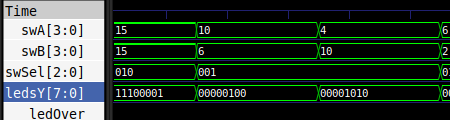

[](https://classroom.github.com/a/sEFmt2_p)
[](https://classroom.github.com/online_ide?assignment_repo_id=21496800&assignment_repo_type=AssignmentRepo)
# Lab02 - Unidad Aritmético-Lógica.

# Integrantes
Juan Mateo jimenez
Pablo Cesar Rincon
# Informe

Indice:

1. [Diseño implementado](#diseño-implementado)
2. [Simulaciones](#simulaciones)
3. [Implementación](#implementación)
4. [Conclusiones](#conclusiones)
5. [Referencias](#referencias)

## Diseño implementado

### Descripción general

El presente proyecto consiste en el diseño e implementación de una **Unidad Aritmético-Lógica (ALU)** de **4 bits** desarrollada en **Verilog HDL** y destinada a operar dentro de una **FPGA Zybo Z7**.  
Esta ALU puede ejecutar operaciones aritméticas y lógicas fundamentales mediante una señal de control (`Sel`) de 3 bits, que define cuál de las funciones internas se activa.  

La ALU fue diseñada bajo un enfoque **modular**, integrando submódulos independientes para cada operación: **suma/resta, multiplicación, corrimiento, movimiento de bits y operación lógica OR**.  
Cada uno de estos módulos produce un resultado que se enruta al bus de salida general (`Y`), controlado por un bloque `case` dentro del módulo principal.  
La arquitectura se complementa con la detección de **banderas de estado** (`Over` y `Zero`) y la coordinación de señales secuenciales (`clk`, `start`, `mult_done`) para garantizar un flujo de operación estable.

---

### Estructura del diseño

El módulo principal, `alu.v`, recibe los siguientes puertos:

| Señal | Tipo | Tamaño | Descripción |
|--------|------|---------|-------------|
| `A`, `B` | Entrada | 4 bits | Operandos principales. |
| `Sel` | Entrada | 3 bits | Selección de la operación. |
| `clk` | Entrada | 1 bit | Señal de reloj. |
| `rst` | Entrada | 1 bit | Reinicio del sistema. |
| `start` | Entrada | 1 bit | Pulso de inicio para operaciones secuenciales (multiplicación). |
| `mult_done` | Entrada | 1 bit | Señal de finalización proveniente del módulo de multiplicación. |
| `Y` | Salida | 8 bits | Resultado general de la operación. |
| `Over` | Salida | 1 bit | Bandera de desbordamiento aritmético. |
| `Zero` | Salida | 1 bit | Bandera que indica resultado igual a cero. |

Internamente, la ALU combina bloques combinacionales y secuenciales.  
Los módulos aritméticos (`sum_res4b`, `mult4b`) y los lógicos (`Cor`, `Move`) se integran mediante un sistema de **comparadores (`comp8b`)** que activan condiciones de control específicas dependiendo del valor de `Sel`.

---

### Operaciones soportadas

| Código `Sel` | Operación | Módulo | Descripción |
|---------------|------------|---------|--------------|
| `000` | **Suma** | `sum_res4b` | Realiza la suma de `A` y `B` con control de *carry* y detección de `overflow`. |
| `001` | **Resta** | `sum_res4b` | Ejecuta la resta binaria `A - B`, reutilizando el sumador con inversión de bits y *carry in*. |
| `010` | **Multiplicación** | `mult4b` | Multiplicador secuencial de 4×4 bits controlado por `clk` y `start`. |
| `011` | **Movimiento/Corrimiento** | `Move.v` | Desplazamiento lógico del operando `A` controlado internamente. |
| `100` | **Operación lógica OR** | `Cor.v` | Realiza la operación lógica bit a bit OR entre `A` y `B`. |

La lógica de selección de salida se define en un bloque `always @(*)`:

```verilog
always @(*) begin
    case (Sel)
        3'b000: Y = {4'b0000, Y_sr[3:0]};  // Suma
        3'b001: Y = {4'b0000, Y_sr[3:0]};  // Resta
        3'b010: Y = Y_mult;                // Multiplicación
        3'b011: Y = Y_move;                // Corrimiento
        3'b100: Y = Y_cor;                 // Operación OR
        default: Y = 8'b00000000;          // Valor por defecto
    endcase
end


### Descripción

### Diagrama

## Simulaciones 
<p align="center">
  
</p>


<p align="center">
  
</p>


## Implementación

## Conclusiones

## Referencias
