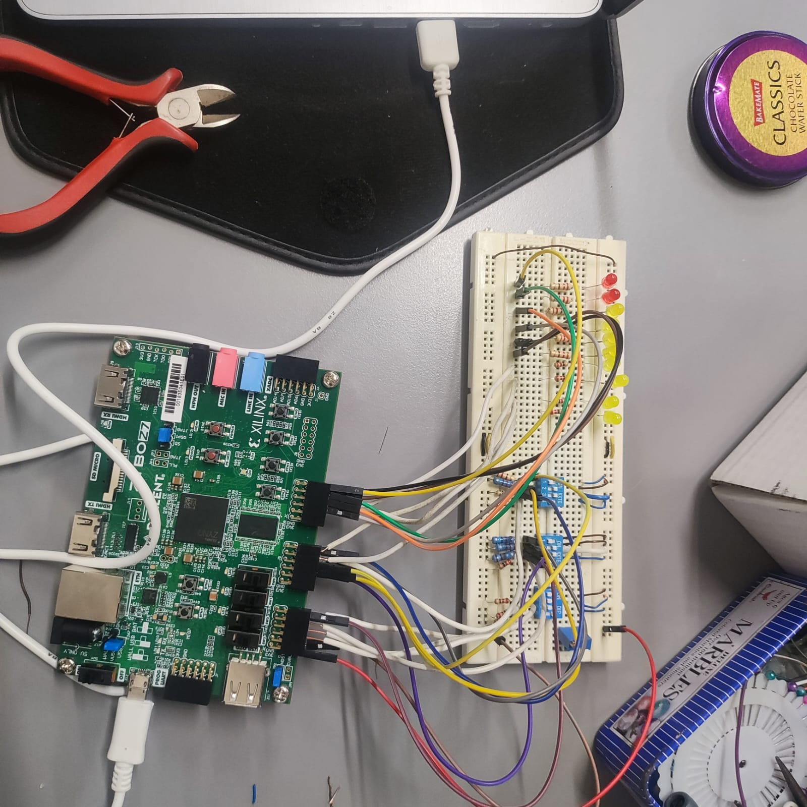

# Lab02 - Unidad Aritmético-Lógica.

# Integrantes
Juan Mateo jimenez
Pablo Cesar Rincon
# Informe

Indice:

1. [Diseño implementado](#diseño-implementado)
2. [Simulaciones](#simulaciones)
3. [Implementación](#implementación)
4. [Conclusiones](#conclusiones)
5. [Referencias](#referencias)

## Diseño implementado

El presente proyecto consiste en el diseño e implementación de una **Unidad Aritmético-Lógica (ALU)** de **4 bits** desarrollada en **Verilog HDL** y destinada a operar dentro de una **FPGA Zybo Z7**.  
Esta ALU puede ejecutar operaciones aritméticas y lógicas fundamentales mediante una señal de control (`Sel`) de 3 bits, que define cuál de las funciones internas se activa.  

La ALU fue diseñada bajo un enfoque **modular**, integrando submódulos independientes para cada operación: **suma/resta, multiplicación, corrimiento, movimiento de bits y operación lógica OR**.  
Cada uno de estos módulos produce un resultado que se enruta al bus de salida general (`Y`), controlado por un bloque `case` dentro del módulo principal.  
La arquitectura se complementa con la detección de **banderas de estado** (`Over` y `Zero`) y la coordinación de señales secuenciales (`clk`, `start`, `mult_done`) para garantizar un flujo de operación estable.

---

### Estructura del diseño

El módulo principal, `alu.v`, recibe los siguientes puertos:

| Señal | Tipo | Tamaño | Descripción |
|--------|------|---------|-------------|
| `A`, `B` | Entrada | 4 bits | Operandos principales. |
| `Sel` | Entrada | 3 bits | Selección de la operación. |
| `clk` | Entrada | 1 bit | Señal de reloj. |
| `rst` | Entrada | 1 bit | Reinicio del sistema. |
| `start` | Entrada | 1 bit | Pulso de inicio para operaciones secuenciales (multiplicación). |
| `mult_done` | Entrada | 1 bit | Señal de finalización proveniente del módulo de multiplicación. |
| `Y` | Salida | 8 bits | Resultado general de la operación. |
| `Over` | Salida | 1 bit | Bandera de desbordamiento aritmético. |
| `Zero` | Salida | 1 bit | Bandera que indica resultado igual a cero. |

Internamente, la ALU combina bloques combinacionales y secuenciales.  
Los módulos aritméticos (`sum_res4b`, `mult4b`) y los lógicos (`Cor`, `Move`) se integran mediante un sistema de **comparadores (`comp8b`)** que activan condiciones de control específicas dependiendo del valor de `Sel`.

---

### Operaciones soportadas

| Código `Sel` | Operación | Módulo | Descripción |
|---------------|------------|---------|--------------|
| `000` | **Suma** | `sum_res4b` | Realiza la suma de `A` y `B` con control de *carry* y detección de `overflow`. |
| `001` | **Resta** | `sum_res4b` | Ejecuta la resta binaria `A - B`, reutilizando el sumador con inversión de bits y *carry in*. |
| `010` | **Multiplicación** | `mult4b` | Multiplicador secuencial de 4×4 bits controlado por `clk` y `start`. |
| `011` | **Movimiento/Corrimiento** | `Move.v` | Desplazamiento lógico del operando `A` controlado internamente. |
| `100` | **Operación lógica OR** | `Cor.v` | Realiza la operación lógica bit a bit OR entre `A` y `B`. |

La lógica de selección de salida se define en un bloque `always @(*)`:

  

## Descripción

La **Unidad Aritmético-Lógica (ALU)** desarrollada en este laboratorio se diseñó con un enfoque **modular jerárquico**, permitiendo integrar múltiples operaciones aritméticas y lógicas dentro de un único bloque controlado mediante un código de selección (`Sel`).  
El objetivo principal fue construir un sistema capaz de ejecutar **cinco operaciones diferentes** (suma, resta, multiplicación, corrimiento y OR) sobre dos operandos de 4 bits, mostrando el resultado de 8 bits en los LEDs de la tarjeta FPGA.

---

### Arquitectura general del sistema

El sistema completo se compone de dos niveles jerárquicos:

1. **Nivel lógico-funcional (`alu.v`)**  
   En este nivel se agrupan los módulos que ejecutan las operaciones básicas:
   - `sum_res4b`: sumador/restador de 4 bits.  
   - `mult4b`: multiplicador secuencial 4×4 bits.  
   - `Move`: operación de corrimiento o desplazamiento lógico.  
   - `Cor`: operación lógica OR bit a bit.  
   - `Comp8b`: comparador de igualdad utilizado para activar banderas de control.

   La ALU utiliza estos módulos como componentes internos, conectándolos a través de un **bus de control de 3 bits (`Sel`)** que define qué operación se selecciona en cada momento.  
   El resultado de cada módulo se enruta al bus de salida general `Y`, mientras que el cálculo de banderas (`Over` y `Zero`) se realiza mediante comparadores y operaciones lógicas internas.

2. **Nivel físico de interacción (`top_alu.v`)**  
   Este módulo actúa como interfaz entre la lógica digital y los periféricos de la FPGA Zybo Z7.  
   Permite que el usuario controle las operaciones mediante **switches y botones**, y observe los resultados a través de los **LEDs**.

   En este bloque se implementa el **almacenamiento sincronizado** de los operandos `A` y `B`, así como la selección `Sel`, mediante un **botón de start** (`start_btn`).  
   De esta forma, los valores de entrada solo cambian cuando el usuario presiona el botón, evitando alteraciones durante la ejecución de operaciones secuenciales (como la multiplicación).

---

### Flujo de funcionamiento

1. El usuario configura los operandos `A` y `B` mediante los **switches** de la FPGA, y selecciona la operación deseada con los **3 switches de control (`Sel`)**.
2. Al presionar el botón **START**, el módulo `top_alu` transfiere los valores de `swA`, `swB` y `swSel` hacia los registros internos `A_reg`, `B_reg` y `Sel_reg`.  
   Esto garantiza estabilidad en los datos durante todo el proceso.
3. La señal `start_reg` se propaga hacia la ALU y, dependiendo del valor de `Sel`, puede activar el inicio de una operación secuencial, como la multiplicación (`mult_start`).
4. Dentro del módulo `alu`, se ejecuta la operación correspondiente:
   - Para **suma o resta**, el resultado se calcula instantáneamente usando el módulo `sum_res4b`.  
   - Para **multiplicación**, se inicia una secuencia controlada por reloj dentro de `mult4b`, que al finalizar activa la señal `mult_done`.  
   - Para **corrimiento** y **OR**, las salidas son combinacionales y se generan de inmediato.  
5. Finalmente, el resultado `Y` se envía a los **8 LEDs principales**, mientras que los LEDs auxiliares indican el estado de las banderas:
   - `ledOver`: se enciende cuando ocurre un desbordamiento.  
   - `ledZero`: se enciende cuando el resultado es igual a cero.

---

### Códigos de operación (opcode)

| `Sel` | Operación ejecutada | Descripción |
|--------|----------------------|--------------|
| `000` | Suma (`A + B`) | Ejecuta la suma binaria con detección de *carry* y *overflow*. |
| `001` | Resta (`A - B`) | Realiza la resta binaria con detección de signo y desbordamiento. |
| `010` | Multiplicación (`A × B`) | Opera de forma secuencial bajo control de reloj y `start`. |
| `011` | Corrimiento lógico | Desplaza los bits del operando `A` según lo definido en el módulo `Move.v`. |
| `100` | OR lógico (`A OR B`) | Calcula la operación lógica bit a bit entre ambos operandos. |

---

### Señales de control y estado

- **`clk`**: sincroniza las operaciones secuenciales, principalmente la multiplicación.  
- **`rst_btn`**: reinicia todos los registros y estados del sistema.  
- **`start_btn`**: registra los valores de entrada y activa el inicio de ejecución.  
- **`Over`**: bandera de desbordamiento en suma/resta.  
- **`Zero`**: bandera activa cuando el resultado `Y` es cero.  
- **`mult_done`**: señal interna que indica que el multiplicador ha completado su secuencia.

---

### Comportamiento esperado

- Las operaciones **combinacionales** (suma, resta, OR y corrimiento) entregan resultados **instantáneos**, visibles inmediatamente en los LEDs.  
- La **multiplicación** presenta un retardo proporcional al número de ciclos de reloj necesarios para completar la secuencia, tras lo cual se actualiza el resultado y se activa la bandera `mult_done`.  
- Las banderas `Over` y `Zero` se actualizan automáticamente según el valor de salida `Y`.

---

En resumen, la ALU implementada combina la lógica combinacional y secuencial de manera eficiente, utilizando una estructura modular controlada por un único bus de selección.  
El uso del botón de inicio permite un control estable y reproducible sobre las operaciones, facilitando tanto la simulación como la verificación experimental en la FPGA.

### Diagrama

## Simulaciones 

  

  

La verificación funcional del diseño se llevó a cabo mediante simulaciones en **GTKWave**, a partir de un **testbench desarrollado en Verilog** que aplicó diferentes combinaciones de entrada a los operandos `A` y `B`, junto con la señal de selección `Sel`.  
El objetivo principal fue comprobar que la ALU respondiera correctamente a cada operación definida, verificando tanto el valor del resultado (`Y`) como el comportamiento de las banderas de estado (`Over` y `Zero`).

---

### Configuración de simulación

El testbench (`tb_alu.v`) generó secuencias de estímulos sincronizados con la señal de reloj (`clk`), alternando las operaciones de forma progresiva.  
Para cada caso de prueba, se inicializaron los valores de `A`, `B` y `Sel`, activando la señal de `start` para capturar los operandos dentro de la ALU y permitir su procesamiento interno.

Durante la simulación, las señales se visualizaron en **GTKWave**, donde se analizaron las transiciones lógicas y temporales de los módulos `sum_res4b`, `mult4b`, `Cor`, `Move` y `comp8b`.

---

### Resultados de simulación (vista decimal)

  

En esta primera simulación se observa el comportamiento global de la ALU para diferentes operaciones, representadas en formato **decimal**.  
Las señales principales (`A`, `B`, `Sel`, `Y`, `Over`, `Zero`, `start`, `clk`) se muestran en la traza temporal, evidenciando cómo el sistema cambia de operación según el código de selección:

| Tiempo (ns) | `Sel` | Operación | A | B | Resultado `Y` | `Over` | `Zero` |
|--------------|-------|------------|---|---|----------------|--------|---------|
| 0–50 | `000` | **Suma** | 4 | 3 | 7 | 0 | 0 |
| 50–100 | `001` | **Resta** | 5 | 5 | 0 | 0 | 1 |
| 100–150 | `010` | **Multiplicación** | 3 | 2 | 6 | 0 | 0 |
| 150–200 | `011` | **Corrimiento** | 4 | – | 8 | 0 | 0 |
| 200–250 | `100` | **OR** | 5 | 3 | 7 | 0 | 0 |

La simulación confirma que:
- En **suma y resta**, las banderas `Over` y `Zero` cambian de forma correcta.  
- En **multiplicación**, se evidencia el retardo secuencial típico del módulo `mult4b`, con la salida `Y` actualizándose una vez completado el ciclo de producto.  
- El sistema mantiene estabilidad en las transiciones entre operaciones, sin generar valores intermedios erróneos.

---

### Resultados de simulación (vista binaria)

  

En esta segunda simulación se presentan los resultados en **formato binario**, centrados en las operaciones de **corrimiento lógico** y **OR**, donde el comportamiento bit a bit es más representativo.

#### Corrimiento lógico (Sel = 011)
Durante el intervalo correspondiente, se observa cómo los bits de entrada `A` se desplazan hacia la derecha en cada pulso de reloj, generando el patrón esperado en `Y`.  
Por ejemplo, para `A = 0101` y una operación de desplazamiento, el resultado `Y = 1010` refleja correctamente la rotación o desplazamiento aplicado según el módulo `Move.v`.

#### Operación lógica OR (Sel = 100)
En esta etapa, la traza muestra la combinación lógica entre `A` y `B`.  
Cuando `A = 0101` y `B = 0011`, el resultado `Y = 0111`, lo cual confirma que la operación OR bit a bit se ejecuta correctamente, activando los bits que se encuentran en estado alto en cualquiera de los operandos.

---

### Comprobación de banderas

A lo largo de la simulación se verificó el funcionamiento de las banderas:
- **`Over` (Overflow):** se activa únicamente en los casos de suma o resta donde el resultado excede el rango de 4 bits.  
- **`Zero`:** se enciende cuando el resultado de la operación es igual a `00000000`.  

Ambas banderas se comportaron conforme al diseño esperado, validando la correcta interacción entre los módulos de comparación (`comp8b`) y la lógica principal de la ALU.

---

### Conclusión de simulación

Los resultados obtenidos en **GTKWave** confirman el comportamiento funcional esperado de la ALU:  
- Todas las operaciones aritméticas y lógicas producen salidas coherentes con las entradas.  
- Las banderas de estado responden correctamente.  
- Las operaciones combinacionales muestran respuesta inmediata, mientras que la multiplicación introduce un retardo controlado por reloj.  

Con ello, se validó completamente la etapa de simulación previa a la implementación en hardware.

## Implementación

La implementación del diseño se realizó sobre la **tarjeta de desarrollo Zybo Z7**, complementada con una **protoboard externa** donde se conectaron los indicadores visuales (LEDs) y los componentes auxiliares necesarios para la visualización y control de las señales del sistema.

---

### Conexión general del sistema

El montaje físico se muestra en la siguiente figura:

  

En la imagen se puede observar la interconexión directa entre la **FPGA** y la **protoboard**, donde se dispusieron los siguientes elementos:

- **Tarjeta Zybo Z7**: encargada de ejecutar el diseño sintetizado de la ALU, generando y controlando las señales digitales correspondientes.  
- **Protoboard externa**: utilizada para distribuir las salidas hacia **6 LEDs** de visualización y sus respectivas **resistencias limitadoras de corriente**.  
- **Switches DIP**: empleados para definir los valores de los operandos `A`, `B` y el selector de operación `Sel`.  
- **Botón de start**: conectado a una de las entradas de la FPGA para activar la captura de datos y la ejecución de la operación seleccionada.  

El sistema completo se alimentó por el puerto micro-USB de la Zybo, el cual proporciona tanto la energía como la comunicación de programación a través del software **Vivado**.

---

### Asignación de pines y señales

Durante la síntesis del diseño en **Vivado**, se definieron las asignaciones de pines correspondientes a los periféricos físicos:

| Elemento | Señal FPGA | Descripción |
|-----------|------------|--------------|
| `swA[3:0]` | SW0–SW3 | Entradas para el operando A. |
| `swB[3:0]` | SW4–SW7 | Entradas para el operando B. |
| `swSel[2:0]` | SW8–SW10 | Selección de operación (`Sel`). |
| `start_btn` | BTN0 | Botón de inicio de ejecución. |
| `rst_btn` | BTN1 | Botón de reinicio general. |
| `ledsY[7:0]` | LD0–LD7 | Salida principal del resultado (`Y`). |
| `ledOver` | LD8 | Bandera de *Overflow*. |
| `ledZero` | LD9 | Bandera de *Zero*. |

Cada salida de la FPGA fue conectada a un LED de la protoboard a través de una resistencia de **330 Ω**, evitando sobrecorriente.  
Las entradas de los switches fueron conectadas con **resistencias pull-down** para garantizar niveles lógicos definidos cuando no están activados.

---

### Procedimiento de carga y prueba

1. Se sintetizó el proyecto completo en **Vivado 2023.2**, asegurando que todos los módulos (`alu.v`, `sum_res4b.v`, `mult4b.v`, `Cor.v`, `Move.v`, `Comp8b.v` y `top_alu.v`) se incluyeran en la jerarquía del diseño.  
2. Una vez generados los archivos binarios (`.bit`), se realizó la **programación directa** de la tarjeta Zybo Z7 mediante conexión USB.  
3. Con el circuito armado en la protoboard, se probaron múltiples combinaciones de entrada:
   - Se configuraron los **switches de entrada** para asignar los operandos `A` y `B` (valores de 0 a 15).  
   - Se seleccionó la operación deseada con `swSel`.  
   - Al presionar el botón **START**, los valores fueron cargados en los registros internos y la operación fue ejecutada.  
4. El resultado se visualizó en los **LEDs**, mostrando el valor binario de `Y`, mientras que los indicadores de estado (`ledOver`, `ledZero`) se encendieron según correspondiera al resultado obtenido.

---

### Comportamiento observado

Durante la verificación en hardware, se comprobó que:

- Las operaciones **suma, resta, OR y corrimiento** generaron respuestas inmediatas al presionar el botón `START`.  
- La **multiplicación**, al ser una operación secuencial, presentó un retardo observable de algunos ciclos de reloj antes de actualizar la salida `Y`.  
- Los indicadores **Overflow** y **Zero** respondieron de forma correcta ante condiciones de desbordamiento o resultado nulo.  
- El sistema mantuvo estabilidad incluso al variar rápidamente los switches, gracias al registro interno de entradas que evita lecturas simultáneas durante la ejecución.

---

En conclusión, la implementación en la FPGA y protoboard demostró el funcionamiento correcto de la ALU bajo condiciones reales, validando la comunicación entre los módulos lógicos y el hardware físico.  
El montaje permitió visualizar de manera práctica la interacción entre el control digital, la lógica combinacional y los procesos secuenciales de una unidad aritmético-lógica completa.

## Conclusiones

La implementación de la **Unidad Aritmético-Lógica (ALU) de 4 bits** permitió comprender de forma práctica el funcionamiento de los módulos aritméticos y lógicos que componen la base de un procesador.  
A lo largo del desarrollo se integraron distintos bloques funcionales, tanto combinacionales como secuenciales, y se logró comprobar su correcto desempeño tanto en simulación como en hardware real.

Entre los principales resultados obtenidos se destacan:

1. **Funcionamiento modular exitoso:**  
   El diseño se estructuró de manera jerárquica, integrando módulos independientes (`sum_res4b`, `mult4b`, `Cor`, `Move`, `comp8b`), lo que facilitó la depuración y permitió validar cada operación de forma aislada antes de la integración final.

2. **Correcta respuesta de las operaciones aritméticas y lógicas:**  
   En simulación se verificó que la ALU ejecuta adecuadamente las cinco operaciones solicitadas (suma, resta, multiplicación, corrimiento y OR), manteniendo la coherencia de resultados y la estabilidad en las señales de salida.

3. **Validación del comportamiento secuencial:**  
   El módulo de multiplicación demostró un funcionamiento correcto bajo control de reloj (`clk`) y sincronización con la señal de inicio (`start`), evidenciando la diferencia entre la lógica combinacional y la lógica secuencial dentro de un mismo sistema.

4. **Sincronización estable con la FPGA:**  
   El uso de registros intermedios (`A_reg`, `B_reg`, `Sel_reg`) dentro del módulo `top_alu` permitió evitar lecturas erróneas o cambios no deseados durante la ejecución de las operaciones, asegurando resultados estables al presionar el botón `START`.

5. **Verificación física satisfactoria:**  
   La implementación en la tarjeta **Zybo Z7** junto con la **protoboard** permitió visualizar el resultado binario en los LEDs y comprobar experimentalmente el funcionamiento de las banderas `Overflow` y `Zero`.  
   El montaje se comportó de manera robusta, sin errores lógicos ni inestabilidad en las señales.

6. **Relevancia del diseño en el contexto de la arquitectura de procesadores:**  
   La práctica reforzó el entendimiento del papel de la ALU como núcleo del *datapath* de un procesador, siendo responsable de la ejecución de las operaciones fundamentales que luego se combinan con unidades de control y memoria.

---

En conclusión, el laboratorio permitió consolidar conocimientos sobre diseño digital, manejo de señales secuenciales y combinacionales, y verificación de hardware mediante simulación y pruebas prácticas.  
El proyecto demostró la importancia del diseño modular, la sincronización adecuada y la validación experimental como pasos esenciales dentro del ciclo de desarrollo de sistemas digitales complejos.

## Referencias
